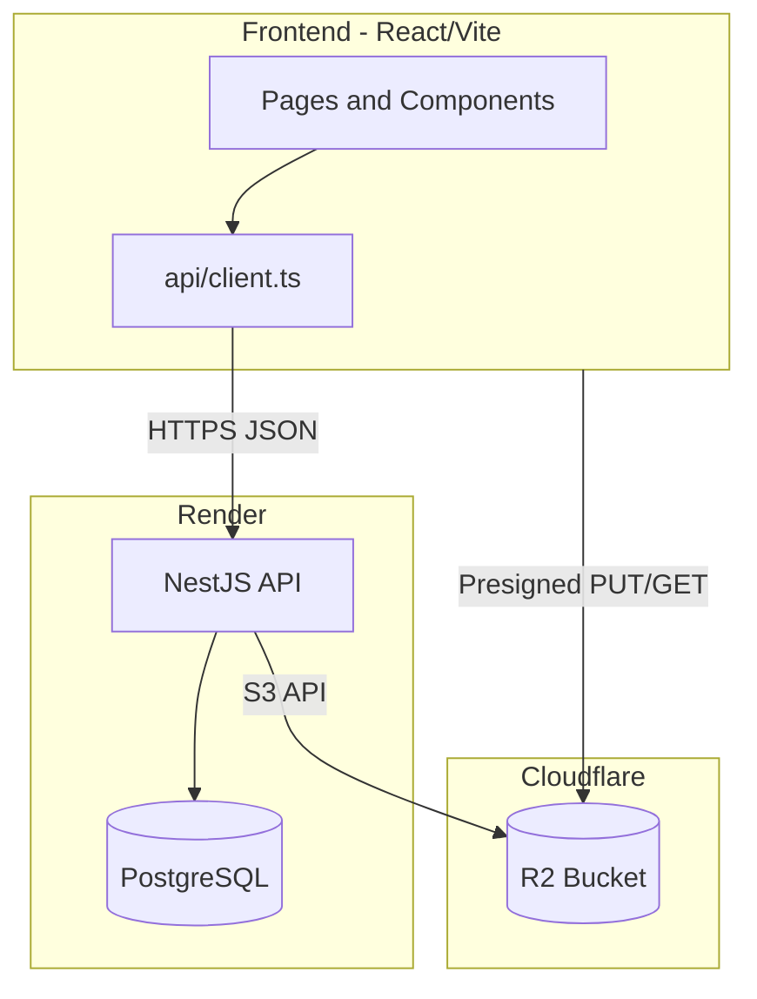
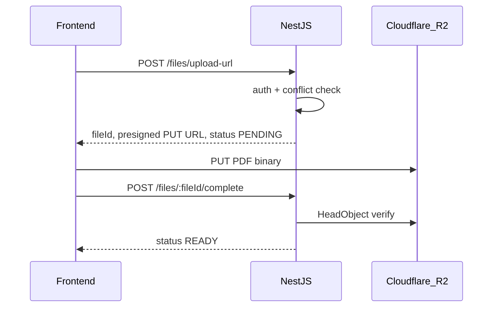

# Data Room MVP Implementation Plan

## Context

- **Source of truth:** [initial-task.md](d:/work/data-room/initial-task.md) (original brief) + your four spec docs
- **Starting point:** Documentation only — no application code yet
- **Locked decisions:** 409 for all file name conflicts; `GET /public/:token/folders/:folderId/contents`; deploy FE + BE + DB on **Render**, files on **Cloudflare R2**
- **Repo layout:** Monorepo with `frontend/` and `backend/`

## Architecture



## Monorepo Structure

```text
data-room/
├── README.md                 # Setup, design decisions, ERD, scaling, AI note (deliverable)
├── docs/                     # Move or symlink existing spec files
│   ├── api.md
│   ├── project_context.md
│   ├── checklist.md
│   └── out-of-scope.md
├── backend/
│   ├── prisma/schema.prisma
│   ├── src/
│   │   ├── auth/
│   │   ├── rooms/
│   │   ├── folders/
│   │   ├── files/
│   │   ├── shares/
│   │   ├── common/           # guards, filters, error codes, pagination
│   │   └── storage/          # R2 S3 client + presigned URL helpers
│   └── package.json
└── frontend/
    ├── src/
    │   ├── api/              # auth.ts, rooms.ts, folders.ts, files.ts, shares.ts
    │   ├── components/       # granular UI components
    │   ├── pages/            # auth, room, public share
    │   ├── hooks/
    │   └── lib/
    └── package.json
```

## Phase 0 — Scaffold (~45 min)

**Backend**
- NestJS app with global prefix `/api`, CORS for `FRONTEND_URL`, validation pipe, exception filter returning `{ code, message, details? }` per [api.md](d:/work/data-room/api.md) §5
- Prisma + PostgreSQL connection
- `@aws-sdk/client-s3` + `@aws-sdk/s3-request-presigner` for R2 (S3-compatible)

**Frontend**
- Vite + React + TypeScript + Tailwind + shadcn/ui
- React Router: `/login`, `/register`, `/rooms/:roomId`, `/rooms/:roomId/folders/:folderId`, `/share/:token`
- Centralized API client with JWT header injection and 401 redirect

**Env vars** (local `.env.example` files, never committed):

| Backend | Frontend |
|---------|----------|
| `DATABASE_URL` | `VITE_API_URL` |
| `JWT_SECRET` | |
| `R2_*` (account, keys, bucket) | |
| `FRONTEND_URL` | |

---

## Phase 1 — Database + Auth (~1 hr)

### Prisma schema

Implement entities from [project_context.md](d:/work/data-room/project_context.md) §4:

- `User`, `DataRoom`, `Folder`, `Folder.parentId` (nullable for root), `File` with `status` enum (`PENDING` | `READY` | `FAILED`), `Share` with polymorphic `resourceType` + `resourceId`

**Critical constraints:**
- `@@unique([folderId, name])` on `File`
- `@@unique([parentId, name])` on `Folder` (handle root separately — root has no sibling)
- Indexes: `Folder.parentId`, `Folder.dataRoomId`, `File.folderId`, `Share.recipientUserId`, `Share.[resourceType, resourceId]`

### Auth module

Endpoints per [api.md](d:/work/data-room/api.md) §8:
- `POST /auth/register`, `POST /auth/login`, `GET /auth/me`
- bcrypt password hashing, JWT (30 min expiry, no refresh)
- `JwtAuthGuard` on all protected routes

### Frontend auth

- Register/login forms with validation (password ≥ 8 chars)
- Token in `localStorage` or `sessionStorage`; logout = clear token + redirect
- Protected route wrapper; redirect unauthenticated users to `/login`

---

## Phase 2 — Data Rooms + Folders (~1.5 hr)

### Backend

**Rooms module**
- `GET /rooms` — owned + shared rooms for current user
- `POST /rooms` — create room + root folder in one Prisma transaction; return `rootFolderId`
- `GET /rooms/:roomId` — metadata with auth check

**Folders module**
- `GET /folders/:folderId/contents` — direct children only, cursor pagination (`limit` default 50, max 100), breadcrumbs in response
- `POST /folders`, `PATCH /folders/:folderId`, `DELETE /folders/:folderId`
- Folder name conflicts → `409 FOLDER_NAME_CONFLICT`
- Recursive subtree delete (sync MVP): folders, files, R2 objects, related shares

**Authorization service** (build early, reuse everywhere):

```text
canRead(user, resource)  → owner | direct share | ancestor share
canWrite(user, resource) → owner only (MVP)
canShare(user, resource) → owner only
```

Public share context gets a separate code path later.

### Frontend

- Room list / create room flow (support multiple rooms per API, primary UX can default to one)
- Folder browser page: table/grid of folders + files, breadcrumb nav from API response
- Create folder dialog, rename inline/modal, delete with confirmation dialog
- Loading skeleton, empty state ("This folder is empty"), error toasts from API `code`

**Folder delete warning:** Show name + generic warning for MVP. Optional enhancement: backend helper to count subtree items before delete (not in API spec — skip if time-constrained).

---

## Phase 3 — Files (~2 hr)

### Upload flow (presigned R2)

Per [api.md](d:/work/data-room/api.md) §11–13:



- `POST /files/upload-url`: validate PDF mime + `.pdf` extension + 50MB max; **409 on name conflict** before creating metadata
- Generate `storageKey`: `rooms/{roomId}/files/{fileId}/{uuid}.pdf`
- `POST /files/:fileId/complete`: verify object exists, mark `READY`; on failure → `FAILED` or remain `PENDING`
- `GET /files/:fileId/view`: short-lived signed GET URL
- `PATCH /files/:fileId` rename, `POST /files/:fileId/move`, `DELETE /files/:fileId` (+ R2 delete)

### Frontend file UX

- Multi-file upload queue with drag-and-drop zone
- Per-file progress bar (XHR/fetch upload to presigned URL)
- 409 conflict dialog: prompt rename or skip file
- PDF preview (iframe or `react-pdf`) using signed view URL
- Rename, move (folder picker modal), delete with confirmation

---

## Phase 4 — Sharing (~1.5 hr)

### Backend shares module

- `POST /shares` — `PRIVATE` (by `recipientEmail`) or `PUBLIC` (generate token, store hash, return URL once)
- `GET /shares?resourceType=&resourceId=` — list shares for owner
- `DELETE /shares/:shareId` — soft revoke via `revokedAt`
- Inherited read access: share on room/folder grants subtree access per [project_context.md](d:/work/data-room/project_context.md) §6

**Public endpoints (no JWT):**
- `GET /public/:token` — resolve share (room / folder / file response shapes)
- `GET /public/:token/folders/:folderId/contents` — scoped folder listing
- `GET /public/:token/file` — file metadata + signed URL

Enforce subtree boundary: reject folders outside shared scope with `403 SHARE_ACCESS_DENIED`.

### Frontend sharing UX

- Share dialog on room/folder/file: toggle public vs permissioned, email input for private
- Copy public link button; show active shares list with revoke action
- Public share page at `/share/:token`: read-only folder browser or PDF viewer
- Permissioned recipient: after login, shared room appears in `GET /rooms`

---

## Phase 5 — UX Polish (~45 min)

Cross-cutting items from [checklist.md](d:/work/data-room/checklist.md):

- Loading states on all async views
- Empty states (no rooms, empty folder, no shares)
- Error states mapped from API codes (`AUTH_*`, `FILE_*`, `FOLDER_*`, `SHARE_*`)
- Destructive action confirmations (delete file/folder, revoke share)
- 409 conflict handling on upload, rename, move, folder create/rename

**Explicitly skip** per [out-of-scope.md](d:/work/data-room/out-of-scope.md): search, versioning, trash, comments, notifications, folder drag-move.

---

## Phase 6 — Deploy on Render (~1 hr)

Per [api.md](d:/work/data-room/api.md) §39:

| Service | Render type | Notes |
|---------|-------------|-------|
| PostgreSQL | Managed DB | Copy `DATABASE_URL`, run `prisma migrate deploy` |
| Backend | Web Service | Node, build + start; set all backend env vars |
| Frontend | Static Site | `VITE_API_URL` baked at build time |

**R2 setup:** Private bucket, CORS allowing frontend origin for PUT/GET on presigned URLs.

**Post-deploy smoke test:**
1. Register → create room → create folder
2. Upload PDF → preview
3. Create public share → open in incognito
4. Create private share → login as recipient → verify access
5. Revoke share → verify 403

---

## README Deliverables (from initial-task.md)

The root [README.md](d:/work/data-room/README.md) must include:

1. **Setup instructions** — local dev, env vars, migrate, run FE/BE
2. **Design decisions** — R2 presigned uploads, 409 conflict strategy, polymorphic shares, cursor pagination, adjacency-list folders
3. **ERD** — copy from project_context or generate from Prisma schema
4. **How it scales** (short answers):
   - Subtree size/count: recursive query on folder tree aggregating `File.sizeBytes` (note future denormalization of `totalFileCount` / `totalSizeBytes`)
   - 100k files: never load full tree; paginate `GET /folders/:id/contents`; index `File.folderId`, `File.[folderId, name]`
   - Viewer/editor roles: reuse `Share.role` field; extend authorization logic without schema changes
5. **AI usage note** — what AI helped with (scaffolding, boilerplate, etc.)
6. **Hosted URLs** — deployed frontend + backend links

---

## Suggested Time Budget (8 hr target)

| Phase | Time |
|-------|------|
| 0 Scaffold | 45 min |
| 1 Auth + DB | 1 hr |
| 2 Rooms + Folders | 1.5 hr |
| 3 Files | 2 hr |
| 4 Sharing | 1.5 hr |
| 5 UX polish | 45 min |
| 6 Deploy + README | 1 hr |

If running over: cut folder delete stats, defer multi-room UI polish, keep sharing + deploy as non-negotiable (required by brief).

---

## Key Implementation Rules

- **Never trust frontend for auth** — every endpoint checks permissions server-side
- **Follow [api.md](d:/work/data-room/api.md) shapes exactly** — do not invent alternate endpoints
- **R2 credentials stay on backend** — frontend only sees presigned URLs
- **Hash public share tokens** — store hash in DB, return raw token only on create
- **Use Prisma transactions** for room+root creation, subtree delete DB portion

---

## Risk Mitigations

| Risk | Mitigation |
|------|------------|
| R2 CORS blocks browser upload | Configure bucket CORS for PUT from frontend origin early |
| Partial upload failure | `PENDING`/`FAILED` states; cleanup orphaned R2 objects on complete failure |
| Race on filename conflict | DB unique constraint + catch Prisma P2002 → return 409 |
| Render cold starts | Acceptable for demo; note in README |
| Time overrun | Ship core path first: auth → folders → upload → one share type → deploy, then add remaining share modes |
