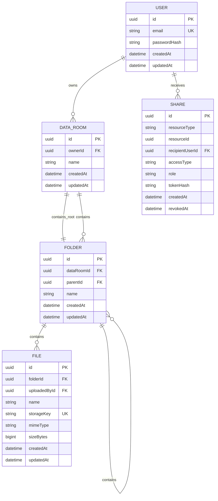

# Data Room MVP — Architecture

## 1. Overview

The application is a full-stack Data Room MVP for securely storing, organizing, viewing, and sharing PDF documents.

The system consists of:

* React + TypeScript frontend
* NestJS backend
* PostgreSQL database managed through Prisma
* Cloudflare R2 object storage for uploaded files
* Email/password authentication with JWT
* Render for frontend, backend, and PostgreSQL deployment
* Cloudflare R2 for durable file storage

The backend is responsible for authentication, authorization, business rules, metadata, and generating temporary storage URLs.

The frontend is responsible for the user interface and communicating with the backend.

PostgreSQL stores file metadata, but never the actual PDF contents.

R2 stores the actual PDF objects.

---

# 2. High-Level Architecture

```text
                           ┌──────────────────────┐
                           │       Browser        │
                           │                      │
                           │ React / TypeScript   │
                           │ Tailwind / shadcn    │
                           └──────────┬───────────┘
                                      │
                         HTTPS / JSON │
                                      │
                           ┌──────────▼───────────┐
                           │      NestJS API      │
                           │                       │
                           │ Authentication       │
                           │ Authorization        │
                           │ Data Rooms            │
                           │ Folders              │
                           │ Files                │
                           │ Sharing              │
                           └─────────┬─────┬───────┘
                                     │     │
                          Prisma     │     │ S3 API
                                     │     │
                         ┌───────────▼─┐ ┌─▼──────────────┐
                         │ PostgreSQL  │ │ Cloudflare R2  │
                         │             │ │                │
                         │ Users       │ │ PDF objects    │
                         │ DataRooms   │ │                │
                         │ Folders     │ │                │
                         │ Files       │ │                │
                         │ Shares      │ │                │
                         └─────────────┘ └────────────────┘
```

---

# 3. Responsibilities

## Frontend

The frontend is responsible for:

* registration and login UI;
* Data Room navigation;
* folder navigation;
* breadcrumb navigation;
* folder creation;
* folder renaming;
* folder deletion;
* file upload;
* drag-and-drop uploads;
* per-file upload progress;
* file preview;
* file renaming;
* file moving;
* file deletion;
* sharing UI;
* public share UI;
* permissioned share UI;
* loading states;
* empty states;
* error states;
* destructive-action confirmations.

The frontend must not make authorization decisions.

It can hide UI elements based on the current user's permissions for UX purposes, but the backend must enforce every permission.

---

## Backend

The NestJS backend is responsible for:

* authentication;
* JWT validation;
* authorization;
* ownership checks;
* inherited folder permissions;
* public share validation;
* permissioned share validation;
* Data Room operations;
* folder operations;
* file metadata;
* file naming conflict detection and `409` responses;
* file movement;
* deletion;
* R2 presigned URL generation;
* input validation;
* database transactions;
* API error handling.

The backend is the source of truth for authorization and business rules.

---

## PostgreSQL

PostgreSQL stores:

* users;
* Data Rooms;
* folders;
* file metadata;
* shares.

PostgreSQL does not store the binary contents of uploaded files.

---

## Cloudflare R2

R2 stores the actual PDF files.

Objects use generated storage keys rather than user-visible filenames.

Example:

```text
rooms/{roomId}/files/{fileId}/{generated-name}.pdf
```

The database stores the R2 `storageKey`.

The original/user-visible filename is stored separately in PostgreSQL.

This means renaming or moving a file does not require renaming or moving the underlying R2 object.

---

# 4. Data Model

The core entities are:

```text
User
DataRoom
Folder
File
Share
```

## ERD



## Entity descriptions

### User

Represents an authenticated application user.

`email` is unique.

Passwords are stored only as secure password hashes.

---

### DataRoom

Represents the top-level virtual Data Room.

Each Data Room has exactly one owner.

A Data Room contains a root folder.

The owner has full access to all content inside the Data Room.

---

### Folder

Folders use an adjacency-list hierarchy through `parentId`.

Example:

```text
Data Room
└── Financials
    ├── 2024
    └── 2025
```

The root folder has no parent.

User-created folders always belong to another folder.

A folder belongs to exactly one Data Room.

---

### File

A file belongs to exactly one folder.

The `name` field is the user-visible filename.

The `storageKey` identifies the actual object in R2.

Example:

```text
name:
acquisition-report.pdf

storageKey:
rooms/123/files/456/generated-object.pdf
```

The two values intentionally have different purposes.

---

### Share

`Share` represents access granted to a Data Room, Folder, or File.

A share has:

```text
resourceType
resourceId
```

where `resourceType` can be:

```text
DATA_ROOM
FOLDER
FILE
```

The resource ID points to the corresponding entity.

This is a polymorphic relationship and therefore cannot be represented by a standard PostgreSQL foreign key to all three resource tables.

For this MVP, the application layer validates that the referenced resource exists and that the user has permission to create/revoke the share.

A future implementation could replace this with separate join tables if stronger database-level referential integrity becomes necessary.

---

# 5. Sharing and Authorization

There are two sharing modes.

## Permissioned sharing

A specific authenticated user receives access.

Example:

```text
Share
resourceType = FOLDER
resourceId = Financials
recipientUserId = John
accessType = PRIVATE
role = VIEWER
```

The recipient must authenticate before accessing the resource.

---

## Public sharing

Anyone with the share URL can access the resource.

Example:

```text
/share/{random-token}
```

Public shares do not require a recipient user.

The token should be generated randomly and stored securely. Prefer storing a hash of the token in the database rather than the raw token.

Public links grant read-only access in the MVP.

---

# 6. Access Rules

The backend evaluates access whenever a protected resource is requested.

A user can read a resource when one of the following is true:

```text
1. The user owns the Data Room.

2. The user has a direct permissioned share for the resource.

3. The resource is inside a folder/Data Room that has been
   shared with the user.

4. The resource is accessed through a valid public share.
```

Example:

```text
Data Room
│
├── Financials          ← shared with John
│   ├── 2024
│   │   └── report.pdf
│   └── 2025
│       └── audit.pdf
│
└── HR
    └── salaries.pdf
```

John can access:

```text
Financials       ✓
2024             ✓
report.pdf       ✓
2025             ✓
audit.pdf        ✓
HR               ✗
salaries.pdf     ✗
```

Sharing a folder grants read access to the entire subtree below that folder.

Sharing a Data Room grants read access to the entire Data Room.

Sharing a file grants access only to that file.

The owner always has full access.

---

# 7. Roles

The MVP implements only:

```text
VIEWER
```

However, the `Share.role` field is designed to support:

```text
VIEWER
EDITOR
```

in the future.

The role should determine capabilities through authorization logic rather than changing the underlying data model.

For example:

```text
VIEWER
- view
- download

EDITOR
- view
- download
- rename
- move
- upload
- create folders
```

Editor functionality is not part of the MVP.

---

# 8. Authentication

The MVP uses email/password authentication.

Registration:

```text
POST /auth/register
```

Login:

```text
POST /auth/login
```

Current user:

```text
GET /auth/me
```

Passwords are never stored in plaintext.

The backend uses a secure password hashing algorithm.

Authenticated requests contain a JWT.

Authentication and authorization are separate concerns:

```text
Authentication:
Who is this user?

Authorization:
Is this user allowed to perform this operation?
```

---

# 9. File Upload Flow

Files are uploaded directly from the browser to R2.

The backend does not proxy the file contents.

```text
Browser
   │
   │ POST /files/upload-url
   ▼
NestJS
   │
   ├── authenticate user
   ├── authorize target folder
   ├── validate file metadata
   ├── generate storage key
   └── generate presigned PUT URL
   │
   ▼
Browser
   │
   │ PUT file
   ▼
Cloudflare R2
   │
   │ upload complete
   ▼
Browser
   │
   │ POST /files/:fileId/complete
   ▼
NestJS
   │
   └── confirm File metadata
       in PostgreSQL
```

If a filename conflict exists at the upload-url step, the backend returns `409 FILE_NAME_CONFLICT` before creating metadata or a presigned URL.

This approach provides:

* direct browser-to-storage upload;
* per-file upload progress;
* reduced backend bandwidth usage;
* no R2 credentials exposed to the frontend.

Only PDF uploads are required by the MVP.

---

# 10. File Viewing Flow

Files remain private in R2.

When a user wants to view a file:

```text
Browser
   │
   │ GET /files/{fileId}/view
   ▼
NestJS
   │
   ├── authenticate
   ├── authorize file access
   └── generate short-lived signed GET URL
   │
   ▼
Browser
   │
   ▼
R2
   │
   ▼
PDF viewer
```

The R2 bucket must not be publicly readable.

Storage credentials must never be exposed to the frontend.

---

# 11. File Naming

File names are unique within a folder.

If a file named `report.pdf` already exists in a folder, the backend rejects the conflicting operation with:

```http
409 Conflict
```

```json
{
  "code": "FILE_NAME_CONFLICT",
  "message": "A file with this name already exists in the folder."
}
```

This applies consistently to upload, rename, and move operations.

The frontend must handle `409` responses and let the user choose a different name or cancel the operation.

The database should enforce uniqueness within the folder where practical.

Database constraints remain important because application-level checks alone are vulnerable to race conditions.

---

# 12. Folder Naming

Folder names should be unique within the same parent folder.

Example:

```text
Financials/
├── 2024
└── 2025
```

Two folders named `2024` cannot exist directly under `Financials`.

The application should return a clear conflict error when attempting to create or rename a folder to an existing name.

---

# 13. Folder Listing

The frontend never loads the entire Data Room hierarchy.

Instead, it requests only the direct contents of the current folder.

Example:

```text
GET /folders/{folderId}/contents
```

The response contains:

```text
folders
files
pagination information
```

Nested folders are loaded only when the user enters them.

This keeps the UI responsive even when a Data Room contains a very large number of files.

---

# 14. Pagination and Scale

Listings use pagination rather than loading all records.

The preferred approach is cursor-based pagination.

Example:

```text
GET /folders/{folderId}/contents?limit=50&cursor=...
```

Relevant database indexes should include:

```text
Folder.parentId
Folder.dataRoomId
File.folderId
File.folderId + name
Share.resourceType + resourceId
Share.recipientUserId
```

For a Data Room containing 100,000 files, the frontend still loads only the current page of files.

The database query should operate against the current folder and use indexes rather than recursively loading the entire Data Room.

---

# 15. Folder Statistics

The MVP can calculate a folder's total subtree size and item count by recursively finding descendant folders and aggregating file metadata.

Conceptually:

```text
Folder
  ↓
descendant folders
  ↓
files
  ↓
COUNT(files)
SUM(sizeBytes)
```

The current implementation prioritizes simplicity.

For a larger production system, folder aggregate values could be denormalized:

```text
totalFileCount
totalSizeBytes
```

and updated transactionally when files are:

* created;
* deleted;
* moved.

This would avoid repeatedly traversing large folder trees.

---

# 16. Deletion

Deleting a file removes:

```text
1. File metadata from PostgreSQL
2. Corresponding object from R2
```

Deleting a folder removes:

```text
1. The folder
2. All descendant folders
3. All files in the subtree
4. Corresponding R2 objects
5. Related shares
```

The frontend must warn the user before deleting a folder.

The confirmation dialog should show the scope of the deletion where practical, for example:

```text
Delete "Financials"?

This will permanently delete:
- 4 folders
- 37 files
- 1.2 GB of data

This action cannot be undone.
```

For a production-scale system, deletion could be moved to an asynchronous background process to handle large subtrees safely.

The MVP can use a synchronous approach if the expected dataset remains small.

---

# 17. Moving Files

Moving a file changes its `folderId`.

The underlying R2 object does not need to move.

Example:

```text
Before:

Financials/
└── report.pdf


After:

Legal/
└── report.pdf
```

Only the PostgreSQL relationship changes.

If the destination folder already contains a file with the same name, the backend returns `409 FILE_NAME_CONFLICT`.

The backend must verify that the user has write access to the destination folder.

---

# 18. Public Share Flow

Public share URLs use a random token.

Example:

```text
https://app.example.com/share/AbCdEf123...
```

The token is resolved by the backend:

```text
GET /public/{token}
```

The backend:

1. validates the token;
2. checks that the share has not been revoked;
3. identifies the shared resource;
4. returns the appropriate read-only resource data.

The public share does not expose the underlying R2 object directly.

File viewing still uses a short-lived signed storage URL.

Public folder and room shares allow browsing the shared subtree through:

```text
GET /public/:token/folders/:folderId/contents
```

The backend must verify that the requested folder is inside the shared subtree before returning contents.

---

# 19. Revoking Access

The owner can revoke a share.

Revocation should not delete historical resource data.

Instead:

```text
Share.revokedAt = current timestamp
```

A revoked share must immediately stop granting access.

This works for both:

```text
PUBLIC
PRIVATE
```

shares.

---

# 20. Important Edge Cases

The implementation should explicitly handle:

### Authentication

* duplicate email registration;
* invalid credentials;
* expired/invalid JWT;
* unauthenticated access to protected resources.

### Folders

* duplicate folder name;
* renaming to an existing name;
* deleting a folder with nested content;
* accessing a folder the user does not own or have access to.

### Files

* duplicate filename on upload (return `409 FILE_NAME_CONFLICT`);
* rename conflicts (return `409 FILE_NAME_CONFLICT`);
* moving into a folder with a conflicting filename (return `409 FILE_NAME_CONFLICT`);
* viewing an unauthorized file;
* deleting a file that no longer exists;
* failed R2 upload;
* database record created but upload failed.

### Sharing

* sharing with oneself;
* sharing with a non-existent user;
* duplicate share;
* revoked share;
* expired/invalid public token;
* accessing a child of an unshared folder;
* owner accessing their own resources;
* inherited folder access.

### Security

* users must never access another user's Data Room by changing an ID in the URL;
* R2 objects must not be publicly readable;
* storage credentials must never reach the frontend;
* every protected backend endpoint must perform authorization checks.

---

# 21. API Structure

The backend is organized around the following modules:

```text
auth
rooms
folders
files
shares
```

Initial API surface:

```text
Authentication

POST   /auth/register
POST   /auth/login
GET    /auth/me
```

```text
Data Rooms

GET    /rooms
POST   /rooms
GET    /rooms/:roomId
```

```text
Folders

GET    /folders/:folderId/contents
POST   /folders
PATCH  /folders/:folderId
DELETE /folders/:folderId
```

```text
Files

POST   /files/upload-url
POST   /files/:fileId/complete
GET    /files/:fileId/view
PATCH  /files/:fileId
POST   /files/:fileId/move
DELETE /files/:fileId
```

```text
Sharing

POST   /shares
GET    /shares
DELETE /shares/:shareId

GET    /public/:token
GET    /public/:token/file
GET    /public/:token/folders/:folderId/contents
```

Exact API contracts are defined in `api.md` and should not be invented independently by individual frontend/backend features.

---

# 22. Error Handling

The backend should use consistent HTTP errors.

Examples:

```text
400 Bad Request
Invalid input.

401 Unauthorized
User is not authenticated.

403 Forbidden
User is authenticated but does not have access.

404 Not Found
Resource does not exist or is not visible to the user.

409 Conflict
Filename/folder-name conflict or duplicate resource.

422 Unprocessable Entity
Valid request structure but invalid business input.

500 Internal Server Error
Unexpected server failure.
```

The frontend should translate these into useful user-facing messages rather than displaying raw backend errors.

---

# 23. Transactions and Consistency

Database operations that modify multiple related records should use Prisma transactions where appropriate.

Examples:

* creating a Data Room and its root folder;
* deleting related database records;
* creating/revoking shares;
* moving a file while validating conflicts.

R2 operations cannot participate in PostgreSQL transactions.

Therefore, operations involving both PostgreSQL and R2 must account for partial failure.

For the MVP, this can be handled with explicit cleanup/error handling.

A production implementation could introduce asynchronous cleanup/reconciliation jobs for stronger eventual consistency.

---

# 24. Deployment Architecture

Deployment to a live environment is **required** for this MVP.

The production environment must use:

```text
Render
├── Frontend
├── NestJS Backend
└── PostgreSQL

Cloudflare
└── R2 Bucket
```

The frontend communicates with the backend over HTTPS.

The backend communicates with PostgreSQL through Prisma.

The backend communicates with R2 using S3-compatible APIs.

The R2 bucket remains private.

Environment-specific secrets must be stored in Render environment variables and must not be committed to Git.

Expected backend environment variables:

```text
DATABASE_URL
JWT_SECRET
R2_ACCOUNT_ID
R2_ACCESS_KEY_ID
R2_SECRET_ACCESS_KEY
R2_BUCKET_NAME
FRONTEND_URL
```

Expected frontend environment variables:

```text
VITE_API_URL
```

The deployed application must support the full upload and viewing flow against the production R2 bucket.

---

# 25. Architectural Decisions

## R2 instead of local filesystem

Render's application filesystem is not suitable for durable file storage.

R2 provides persistent object storage and is independent of the backend deployment lifecycle.

---

## Presigned URLs

Files are uploaded directly from the browser to R2.

This avoids routing large files through NestJS and allows the frontend to provide per-file upload progress.

---

## PostgreSQL for metadata

Relational data such as ownership, folder hierarchy, file metadata, and sharing relationships benefits from PostgreSQL's constraints, transactions, and indexes.

Binary files are better suited to object storage.

---

## Adjacency-list folder hierarchy

Folders use `parentId`.

This keeps the MVP data model simple and makes folder creation/movement straightforward.

If the hierarchy becomes extremely large or subtree queries become a bottleneck, a materialized-path or closure-table approach could be considered.

---

## Polymorphic Share resource

A single Share model can represent access to:

```text
DataRoom
Folder
File
```

This avoids three separate sharing systems and makes adding roles such as `EDITOR` straightforward.

The tradeoff is that PostgreSQL cannot enforce a standard foreign key for the polymorphic `resourceId`.

The application layer therefore owns validation of the referenced resource.

---

## Cursor pagination

The UI never loads an entire Data Room.

Only the current folder's direct children are queried, using pagination.

This allows the same basic architecture to work when a Data Room contains tens or hundreds of thousands of files.

---

# 26. Non-Goals

The following are intentionally outside the MVP:

* full-text search;
* file versioning;
* audit/activity log;
* trash/recycle bin;
* comments;
* email notifications;
* collaborative editing;
* antivirus scanning;
* OCR;
* file previews other than PDF;
* editor permissions;
* real-time collaboration;
* background job infrastructure.

Optional requirements such as search and versioning should only be implemented after all required functionality is complete and polished.

---

# 27. Implementation Principle

The implementation should prioritize, in order:

1. Correct functionality
2. Security and authorization
3. UX and error handling
4. Clean architecture
5. Performance
6. Optional features

The system should prefer simple, explicit solutions over unnecessary abstractions.

AI-generated code must follow the architecture and domain rules defined in this document rather than introducing new architectural patterns without discussion.
